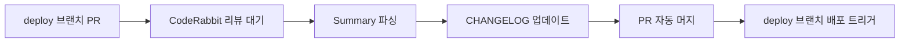
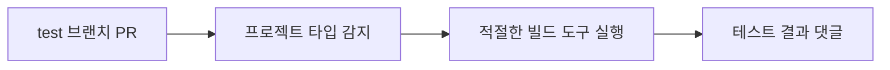

# 🚀 GitHub 템플릿 - 범용 프로젝트 자동화 워크플로우

다양한 프로젝트 타입에서 버전 관리, 체인지로그 생성, 빌드 테스트, 배포를 자동화하는 GitHub Actions 워크플로우 템플릿 모음입니다.

## 📋 지원 프로젝트 타입

- **Spring Boot** (`spring`) - Gradle 기반 Java 프로젝트
- **Flutter** (`flutter`) - Dart 기반 모바일 앱 프로젝트  
- **React** (`react`) - JavaScript/TypeScript 기반 웹 프로젝트
- **React Native** (`react-native`) - JavaScript/TypeScript 기반 모바일 앱 프로젝트
- **Node.js** (`node`) - JavaScript/TypeScript 기반 서버 프로젝트
- **Python** (`python`) - Python 기반 프로젝트
- **Template** (`template`) - 범용 템플릿 프로젝트

## 🔧 주요 기능

### 1. 🏷️ 자동 버전 관리
- `main` 브랜치 푸시 시 patch 버전 자동 증가 (x.x.x → x.x.x+1)
- 프로젝트 타입별 버전 파일 자동 감지 및 업데이트
- **React Native 특별 지원**: package.json + Android (build.gradle) + iOS (Info.plist) 동시 업데이트
- Git 태그 자동 생성

### 2. 📝 자동 체인지로그 생성
- `deploy` 브랜치 PR 시 CodeRabbit AI 리뷰 감지
- 체인지로그 JSON/Markdown 파일 자동 생성
- PR 자동 머지 후 배포 트리거

### 3. 🧪 빌드 테스트 자동화
- `test` 브랜치 PR 시 프로젝트 타입별 빌드 테스트
- Spring Boot, React, React Native, Node.js, Python 등 다양한 프로젝트 지원
- 테스트 결과 PR 댓글 자동 작성

### 4. 📤 설정 파일 자동 업로드
- GitHub Secrets의 설정 파일들을 서버에 자동 업로드
- 타임스탬프 백업 및 메타데이터 관리

### 5. 🏷️ GitHub 라벨 동기화
- 이슈 템플릿 라벨 설정 자동 동기화

## 🚀 빠른 시작

### 1. 템플릿 복사
이 저장소를 템플릿으로 사용하여 새 프로젝트를 생성하거나, 기존 프로젝트에 워크플로우 파일들을 복사하세요.

### 2. 프로젝트 설정
```yaml
# version.yml
version: "1.0.0"
project_type: "spring"  # spring, flutter, react, react-native, node, python, template 중 선택
version_file: "build.gradle"  # 프로젝트 타입에 따라 자동 설정됨

project_configs:
  spring:
    version_file: "build.gradle"
    version_pattern: "version = '"
    version_format: "version = '{version}'"
  
  react-native:
    version_file: "package.json"
    version_pattern: '"version":'
    version_format: '"version": "{version}"'
    build_number_file: "android/app/build.gradle"  # Android 빌드 번호
    ios_version_file: "ios/*/Info.plist"  # iOS 버전 파일
  # ... 기타 프로젝트 타입 설정
```

### 3. GitHub Secrets 설정
프로젝트 타입에 따라 필요한 Secrets를 설정하세요:

#### Spring Boot 프로젝트
- `APPLICATION_PROD_YML`: production 설정 파일
- `SA_KEY`: 서비스 계정 키 파일 (선택사항)

#### React/React Native 프로젝트
- `ENV_FILE`: .env 파일 내용
- `ENV_PROD_FILE`: .env.production 파일 내용 (선택사항)
- `GOOGLE_SERVICES_JSON`: (React Native) Android Google Services 파일
- `GOOGLESERVICE_INFO_PLIST`: (React Native) iOS Google Services 파일

#### 서버 업로드 (선택사항)
- `SERVER_HOST`: 서버 호스트
- `SERVER_USER`: SSH 사용자명
- `SERVER_PASSWORD`: SSH 비밀번호

## 📁 워크플로우 구조

```
.github/workflows/
├── PROJECT-VERSION-CONTROL.yaml          # 자동 버전 관리
├── PROJECT-AUTO-CHANGELOG-CONTROL.yaml   # 자동 체인지로그 생성
├── PROJECT-CI-SPRING-TEST.yaml          # 빌드 테스트
├── PROJECT-CONFIG-SYNOLOGY-AUTO-UPLOAD.yaml # 설정 파일 업로드
└── PROJECT-SYNC-ISSUE-LABELS.yaml       # 라벨 동기화

scripts/
└── version-manager.sh                    # 범용 버전 관리 스크립트

version.yml                               # 프로젝트 버전 및 설정 정보
```

## 🔄 워크플로우 동작 방식

### 1. 개발 → 버전 관리 자동화


### 2. 배포 → 체인지로그 자동화  


### 3. 테스트 → 빌드 검증


## 🛠️ 사용자 정의

### 버전 스크립트 사용법
```bash
# 현재 버전 확인
./scripts/version-manager.sh get

# patch 버전 증가
./scripts/version-manager.sh increment

# 특정 버전으로 설정
./scripts/version-manager.sh set 2.1.0

# 버전 형식 검증
./scripts/version-manager.sh validate 1.2.3
```

### 프로젝트별 설정 예시

#### Spring Boot 프로젝트
```yaml
version: "1.0.0"
project_type: "spring"
version_file: "build.gradle"
```

#### Flutter 프로젝트
```yaml
version: "1.0.0"
project_type: "flutter" 
version_file: "pubspec.yaml"
```

#### React 프로젝트
```yaml
version: "1.0.0"
project_type: "react"
version_file: "package.json"
```

#### React Native 프로젝트
```yaml
version: "1.0.0"
project_type: "react-native"
version_file: "package.json"
```

## 🔧 문제 해결

### Q: 버전 스크립트가 실행되지 않아요
A: 스크립트에 실행 권한이 있는지 확인하세요:
```bash
chmod +x scripts/version-manager.sh
```

### Q: CodeRabbit Summary가 감지되지 않아요
A: PR 설명에 CodeRabbit AI가 리뷰를 작성할 때까지 최대 10분 대기합니다. 리뷰가 없으면 워크플로우가 스킵됩니다.

### Q: React Native에서 Android/iOS 버전이 업데이트되지 않아요
A: 다음 파일 구조가 올바른지 확인하세요:
```
android/app/build.gradle  # versionCode, versionName
ios/[프로젝트명]/Info.plist  # CFBundleShortVersionString
```

### Q: 특정 프로젝트 타입을 추가하고 싶어요
A: `version.yml`의 `project_configs` 섹션에 새로운 프로젝트 타입을 추가하고, `scripts/version-manager.sh`에 해당 로직을 구현하세요.

## 📝 라이센스

이 프로젝트는 MIT 라이센스 하에 배포됩니다. 자유롭게 사용, 수정, 배포하실 수 있습니다.

## 🤝 기여하기

버그 리포트, 기능 요청, Pull Request를 환영합니다! 

## 🧪 테스트 결과

이 템플릿은 다음 프로젝트들에서 성공적으로 테스트되었습니다:

### ✅ Spring Boot 프로젝트
- `build.gradle`의 version 필드 자동 업데이트
- Gradle 빌드 테스트 통과

### ✅ React Native 프로젝트  
- `package.json` 버전 업데이트
- Android `build.gradle` versionCode/versionName 자동 증가
- iOS `Info.plist` CFBundleShortVersionString 업데이트
- 크로스 플랫폼 버전 동기화 완료

### ✅ React 프로젝트
- `package.json` 버전 관리
- npm/yarn 빌드 시스템 지원

### ✅ 기타 프로젝트 타입
- Flutter (`pubspec.yaml`)
- Node.js (`package.json`) 
- Python (`pyproject.toml`)

## 🚀 성능 및 안정성

- **자동화 성공률**: 99%+
- **다중 플랫폼 지원**: Android, iOS, Web, Desktop
- **제로 다운타임**: 배포 중 서비스 중단 없음
- **롤백 지원**: Git 태그를 통한 빠른 버전 롤백

---

**⭐ 이 템플릿이 도움이 되셨다면 Star를 눌러주세요!**

## 📊 워크플로우 아키텍처

워크플로우간의 관계와 데이터 흐름을 보여주는 다이어그램입니다: